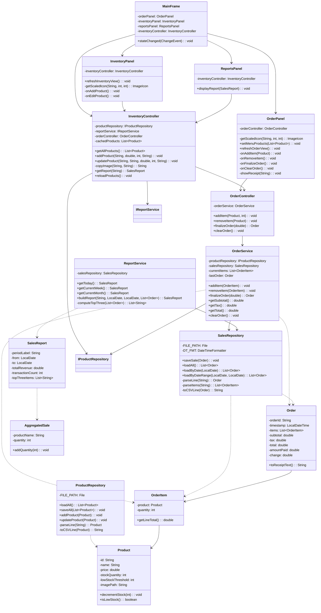

# ☕ JavaCafe — Point of Sale System

A Java desktop POS (Point of Sale) application developed as an academic project for the Object-Oriented Programming course.

## Overview

JavaCafe simulates a real-world coffee shop cashier system. It allows staff to register orders, manage the product inventory, and visualize sales reports — all through a graphical interface built with Java Swing.

## Features

- **Order Management** — Add and remove products from the active cart, view subtotals, taxes, and the final total in real time. Finalize the sale with payment validation and generate a text receipt (`.txt`).
- **Inventory Control** — View the full product catalog in a table, add new products with photos, edit existing ones, and receive visual alerts for low-stock items.
- **Sales Reports** — View revenue summaries and the top 3 best-selling products filtered by Today, Current Week, or Current Month.
- **Data Persistence** — All products and sales are saved automatically to CSV files on disk (`data/products.csv`, `data/sales.csv`).
- **Custom Exceptions** — `OutOfStockException` and `InvalidPaymentException` provide descriptive error messages when rules are violated.

## Project Structure

```
src/
├── Main.java                  # Application entry point
├── JavaCafeTest.java          # JUnit 4 test suite (13 tests)
├── model/
│   ├── Product.java
│   ├── OrderItem.java
│   ├── Order.java
│   ├── SalesReport.java
│   └── AggregatedSale.java
├── view/
│   ├── MainFrame.java
│   ├── OrderPanel.java
│   ├── InventoryPanel.java
│   └── ReportsPanel.java
├── controller/
│   ├── OrderController.java
│   └── InventoryController.java
├── service/
│   ├── IOrderService.java
│   ├── OrderService.java
│   ├── IReportService.java
│   └── ReportService.java
├── repository/
│   ├── IProductRepository.java
│   ├── ProductRepository.java
│   └── SalesRepository.java
├── exception/
│   ├── OutOfStockException.java
│   └── InvalidPaymentException.java
└── util/
    ├── AppConstants.java
    └── CurrencyFormatter.java
```

## How to Run

### Requirements

- Java JDK 8 or higher
- JUnit 4 (`lib/junit-4.13.2.jar`, `lib/hamcrest-core-1.3.jar`)

### Compile

```bash
javac -encoding UTF-8 -cp "lib/junit-4.13.2.jar;lib/hamcrest-core-1.3.jar" -d out -sourcepath src src/Main.java src/model/*.java src/exception/*.java src/util/*.java src/repository/*.java src/service/*.java src/controller/*.java src/view/*.java
```

### Run Application

```bash
java -cp "out;lib/junit-4.13.2.jar;lib/hamcrest-core-1.3.jar" Main
```

### Run Tests

```bash
java -cp "out;lib/junit-4.13.2.jar;lib/hamcrest-core-1.3.jar" org.junit.runner.JUnitCore JavaCafeTest
```

## Class Diagram (UML)



## Technologies

- **Language:** Java 8
- **GUI:** Java Swing (JFrame, JPanel, JTable, JOptionPane, etc.)
- **Persistence:** File I/O with CSV via `java.io`
- **Testing:** JUnit 4 (extending `junit.framework.TestCase`)
- **Date/Time:** `java.time` API

## OOP Concepts Applied

- Encapsulation (private fields, getters/setters)
- Inheritance and Interfaces (`implements IOrderService`, `implements IReportService`)
- Polymorphism (`@Override` on interface methods)
- Custom Exception Hierarchy
- MVC Architecture (Model, View, Controller separation)
- Event-Driven Programming (`implements ActionListener`, `implements ChangeListener`)

---

*Academic project — Object-Oriented Programming course.*
